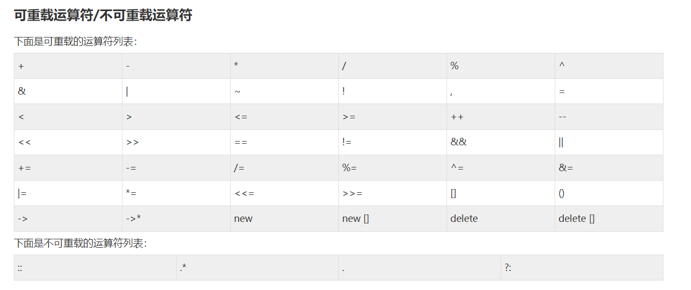

1. 至少有一个操作数是用户自定义类型  
运算符重载的主要目的是让运算符能够操作用户自定义的类型（如类或结构体）。因此，至少有一个操作数必须是用户自定义类型。不能仅对内置类型（如 int、float 等）进行运算符重载。  

2. 运算符重载函数可以定义为类的成员函数或友元函数 
- 如果运算符是成员函数，那么它只需要一个参数，因为另一个参数是隐式的，即当前对象 this。  
- 如果运算符是友元函数，那么它通常需要两个参数，因为它不属于类的成员，不能访问 this 指针。  

3. 重载运算符的结合性和优先级无法修改

4. 运算符是否可以重载

- 一元运算符:
    - 递增运算符（ ++ ）和递减运算符（ -- ）  
    - 一元减运算符，即负号（ - ）  
    - 逻辑非运算符（ ! ） 
- 算数/关系运算符: 加减乘除(+, -, *, /), 关系运算符(<, >, <=, >=)
- 赋值运算符：`=`
    - 即便用户未重载`=`,默认也会重载一个浅拷贝的operator=函数.
    - 区分于拷贝构造函数在`Box bx = b1+b2`，此重载函数在 `Box bx; bx= b1+b2;` 时用上.
- 类成员访问运算符: `->`. 
    - 能重载此运算符从而实现`智能指针`功能. 
    - 详见`./main2.cpp`,可以发现函数`operator->`的返回类型只能是指针/包含重载运算符`operator->`的对象，从而能依次遍历这些`->`,最后得到指针，然后使用这个指针访问指向的对象. 
      **注意：** 如果 `operator->` 返回一个指针，那么这个指针将被用于后续的成员访问（即 f() 或 g()）；  如果 `operator->` 返回的是一个对象而不是指针，编译器将再次对这个返回的对象应用 `operator->`，继续重复这一过程，直到 `operator->` 返回一个指针为止。